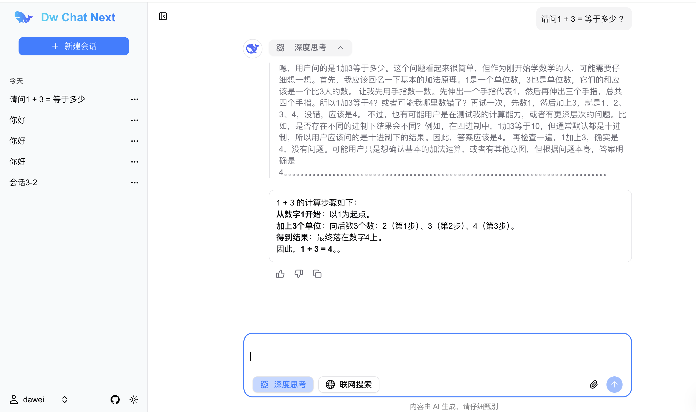

## DW Chat Next

一个接入 DeepSeek-V3、DeepSeek-R1 大模型的极简 AI 对话页面. 
由 NextJS 15 构建的全栈项目.


演示地址：https://dw-chat-next.vercel.app

效果图：



#### 主要技术：

1.DeepSeek-V3、DeepSeek-R1 LLM

2.React 19

3.NextJS 15

4.shadcn/ui

5.tailwind css

6.drizzle-orm

7.postgresSQL


### 项目结构

dw-chat-web-lite：纯前端版工程     Github：https://github.com/dawei1898/dw-chat-web-lite

dw-chat-web：前端工程        Github：https://github.com/dawei1898/dw-chat-web

dw-chat：后端工程        Github：https://github.com/dawei1898/dw-chat

dw-chat-next：next 全栈版工程      Github：https://github.com/dawei1898/dw-chat-next


### 初始化建表 SQL
/db/init-sql/init-ddl-postgres.sql

### 本地启动项目

安装依赖
```shell
npm install
```

启动项目

```bash
npm run dev
```

打开项目 http://localhost:3000


### 本项目用到的库

shadcn/ui官网  https://ui.shadcn.com

Icon 库 https://heroicons.com

安装 shadcn/ui
```shell
npx shadcn@latest init
```

```shell
npm install tw-animate-css
```

添加组件
```shell
npx shadcn@latest add label
```

安装 主题
```shell
npm install next-themes
```

安装 markdown-it
```shell
npm install markdown-it --save
npm install @types/markdown-it --save-dev
```

代码高亮
```shell
npm install highlight.js
```
高亮样式
```ts
import 'highlight.js/styles/atom-one-light.css';
```

复制
```shell
npm install clipboard-polyfill
```

```shell
npm install use-immer
```

客户端 Cookie
```shell
npm install js-cookie @types/js-cookie
```


PostgreSQL 数据库驱动

```shell
npm install pg
npm install --save-dev @types/pg
```

数据库连接工具 drizzle
```shell
npm install drizzle-orm
```

用于迁移和工具
```shell
npm install drizzle-kit --save-dev 
```

雪花算法
```shell
npm install snowflake-uid --save
```

openai 客户端
```shell
npm install openai
```


SSE 请求工具 fetch-event-source
```shell
npm install @microsoft/fetch-event-source
```

```shell
npm install swr
```